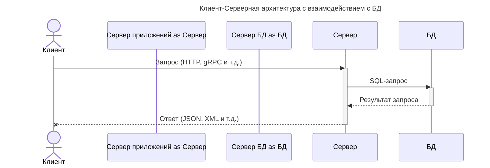

# Технический долг 

```mermaid
sequenceDiagram
    title Клиент-Серверная архитектура с взаимодействием с БД
    
    actor Клиент
    participant Сервер приложений as Сервер
    participant Сервер БД as БД
    
    Клиент->>Сервер: Запрос (HTTP, gRPC и т.д.)
    activate Сервер
    
    Сервер->>БД: SQL-запрос
    activate БД
    
    БД-->>Сервер: Результат запроса
    deactivate БД
    
    Сервер--xКлиент: Ответ (JSON, XML и т.д.)
    deactivate Сервер


```
