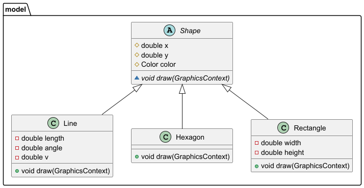
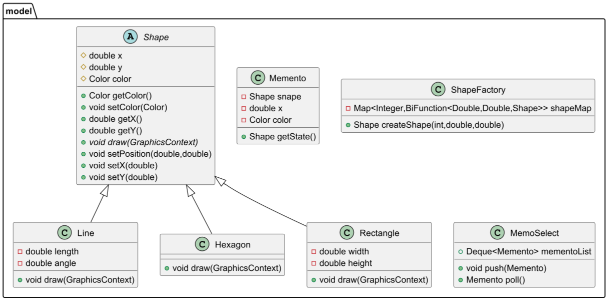

Добавлен README
# Паттерн Абстрактный класс
Абстрактный класс — это класс, который содержит один или несколько методов, объявленных, но не реализованных. Его цель — определить общую структуру и поведение для дочерних классов, которые будут конкретизировать эти методы. Абстрактные классы нельзя инстанцировать напрямую, их используют исключительно как основу для создания конкретных реализаций.

# Паттерны Фабричный метод и Хранитель
Фабричный метод — это порождающий паттерн проектирования, который определяет интерфейс для создания объектов, позволяя подклассам решать, какой именно класс инстанцировать. Это позволяет делегировать создание объектов подклассам, делая систему независимой от конкретных продуктов, которые создаются.

Хранитель (Memento) — это поведенческий паттерн проектирования, который позволяет сохранять и восстанавливать внутренние состояния объекта без раскрытия его внутренней структуры. Хранитель сохраняет "снимок" состояния объекта, который позже можно использовать для восстановления объекта в прежнее состояние.

