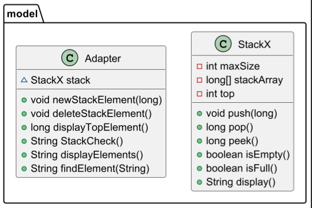

# Паттерн Адаптер
Паттерн Адаптер — это структурный паттерн проектирования, который позволяет объектам с несовместимыми интерфейсами работать вместе. Адаптер преобразует интерфейс одного класса в другой интерфейс, ожидаемый клиентом. Таким образом, клиент может использовать уже существующие классы даже тогда, когда их интерфейсы не совпадают.
