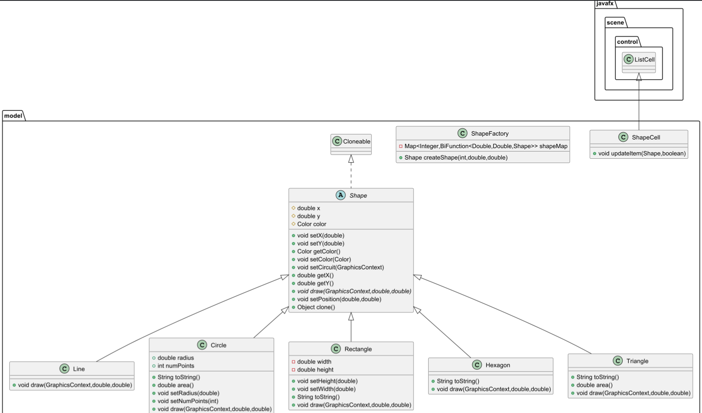

# Паттерн Прототип
Паттерн Прототип — это порождающий паттерн проектирования, который позволяет создавать новые объекты путем копирования существующих объектов (прототипов), а не через создание с нуля. Этот подход полезен, когда создание объекта требует значительных ресурсов или сложной логики инициализации.
