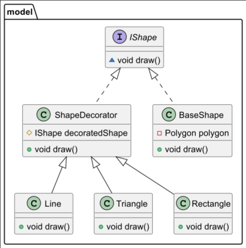

# Паттерн Декоратор
Паттерн Декоратор — это структурный паттерн проектирования, который позволяет динамически добавлять объекту новые обязанности и поведение без изменения самого объекта. Вместо создания подклассов и наследования, декорирование заключается в обертывании одного объекта другим объектом, который добавляет дополнительные функции. Это помогает избежать раздувания иерархии классов и делает код более гибким.

